---

## Préparation de la machine virtuelle

Pour commencer à créer une machine virtuelle, nous allons utiliser Oracle VM Virtualbox. Ces étapes commencent par modifier le nom, le dossier destinataire et l'image ISO à installer depuis le site de Debian, comme ci-dessous.

| Étape                             | Description                                     |
| --------------------------------- | ----------------------------------------------- |
| Modifier le nom                   | Renommer la machine virtuelle                  |
| Modifier le dossier destinataire  | Choisir l'emplacement pour stocker les fichiers |
| Choisir l'image ISO [^1]          | Sélectionner l'image ISO à partir du site de Debian |

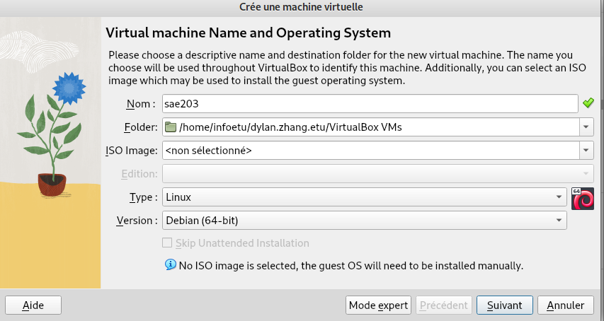{ width=500 }

Nous allons ensuite attribuer l'espace mémoire nécessaire et allouer de l'espace pour le disque.

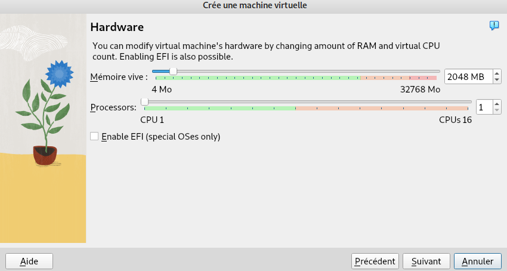{ width=500 }

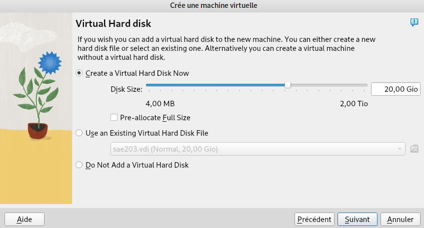{ width=500 }

Une fois que toutes les étapes précédentes sont faites, nous allons configurer la machine virtuelle.

[^1]: Organisation internationale de normalisation

---

### Question 1. Configuration matérielle dans VirtualBox

---

| Question | Réponse                |
| -------- | ---------------------- |
| Signification de "64-bit" dans "Debian 64-bit" | Le terme "64-bit" fait référence à la compatibilité avec les processeurs 64 bits, permettant d'utiliser plus de 4 Go de RAM et d'exécuter des applications optimisées pour cette architecture. |
| Configuration réseau utilisée par défaut | La configuration réseau par défaut est généralement en mode NAT, permettant à la machine virtuelle d'accéder à Internet via le réseau hôte. |
| Nom du fichier XML contenant la configuration de votre machine | Le nom du fichier XML contenant la configuration de la machine virtuelle peut varier en fonction de l'utilisateur et de l'emplacement de la configuration. |
| Modification du fichier de configuration pour mettre 2 processeurs | Vous pouvez modifier le fichier de configuration de la machine virtuelle pour attribuer plus de processeurs en modifiant le paramètre `<CPUs>` dans le fichier XML. |
---

### Installations de l'OS

---

| Étape                             | Description                                     |
| --------------------------------- | ----------------------------------------------- |
| Nommage de la machine             | Renommer la machine debian par s203                 |
| Changer la langue du clavier      | Choisir le disposition FR pour le clavier|
| Config root                       | Créer le mot de passe pour root |
| Config user                       | Créer un utilisateur User et mettre son mot de passe user|
| Dépot paquetage debian            | Choisir le dépot de paquetage debian.polytech |
| Proxy                             | Ne pas choisir de proxy |
| Partitionnement du disque         | Partitionnement automatique |
| Installation logiciel             | Cocher environnement de bureau Debian, MATE, serveur web, serveur ssh, utilitaires usuels du système |
| Installation Grub[^2]             | Installer Grub sur le bon périphérique /dev/sda |

***
Nommage de la machine :

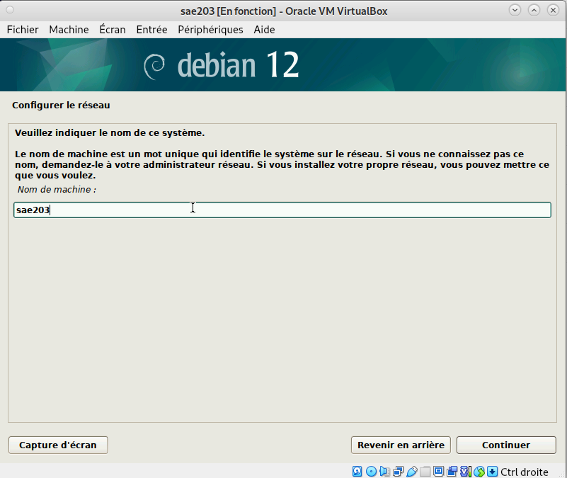{ width=500 }

Choix de la langue et du clavier :

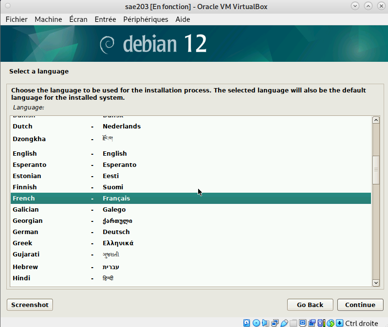{ width=500 }

Pour configurer le mot de passe de root :

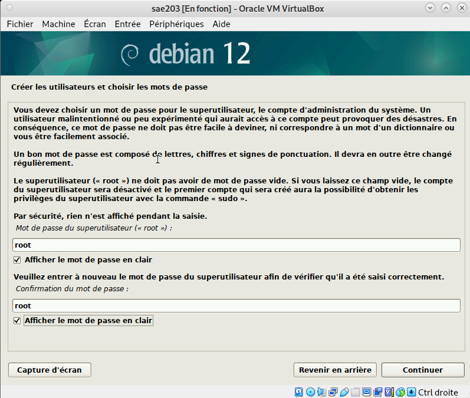{ width=500 }

Configuration de l'utilisateur :

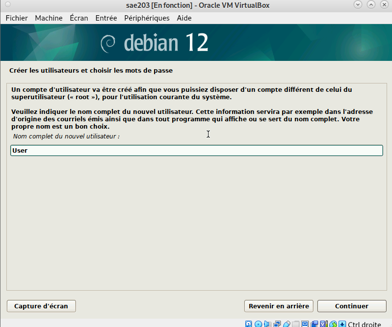{ width=500 }
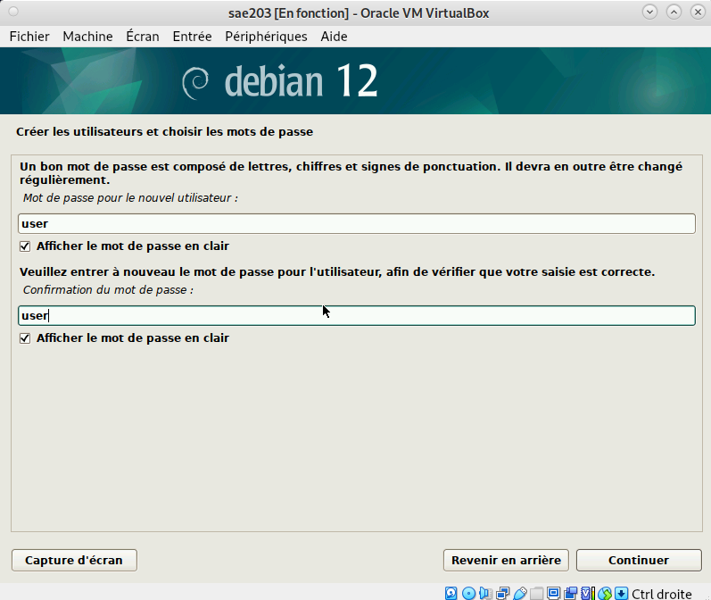{ width=500 }

Pour changer la disposition du clavier en français

{ width=500 }

Pour choisir le serveur de paquetage debian.polytech :

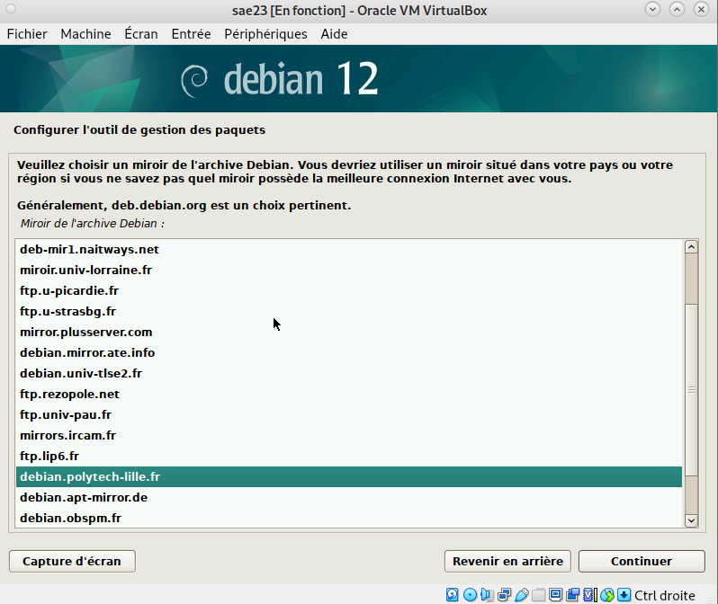{ width=500 }

Choix du proxy (aucun) :

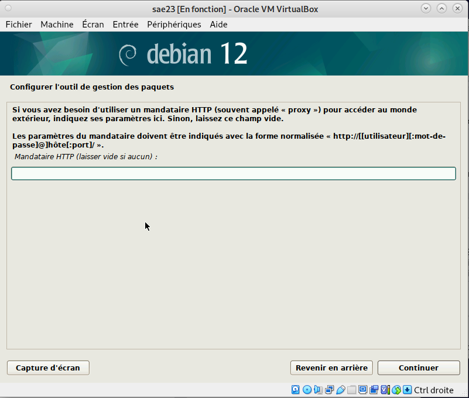{ width=500 }

Partitionnement des disques :

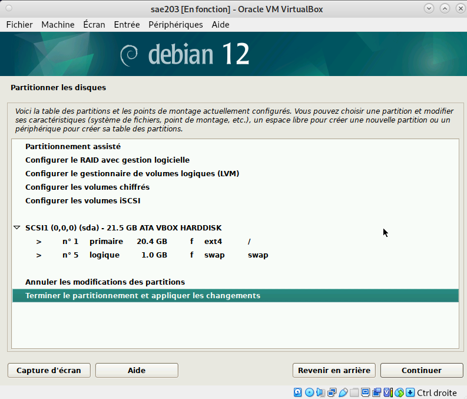{ width=500 }

Installation des logiciels de démarrage :

{ width=500 }

Installation du Grub :

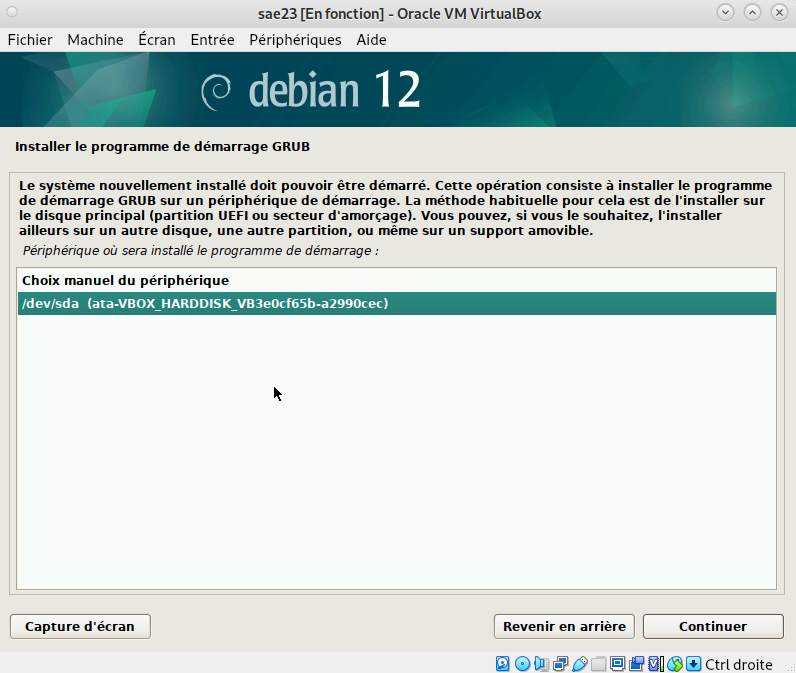{ width=500 }

[^2]: GRUB (Grand Unified Bootloader) est un chargeur d'amorçage (bootloader) largement utilisé dans les systèmes d'exploitation basés sur Linux. Son rôle principal est de charger le système d'exploitation lors du démarrage de l'ordinateur.

---

### Question 2. Installations OS de base

---

| Question                                           | Réponse                                                                                      |
|---------------------------------------------------|----------------------------------------------------------------------------------------------|
| Qu'est-ce qu'un fichier iso bootable ?            | Un fichier iso bootable est un fichier image créé à partir d'un CD ou DVD contenant un système d'exploitation. |
| Qu'est-ce que MATE ? GNOME ?                     | MATE et GNOME sont des environnements de bureau pour les systèmes Linux, y compris Debian.     |
| Qu'est-ce qu'un serveur web ?                     | Un serveur web est un logiciel qui permet de servir des pages web via le protocole HTTP.       |
| Qu'est-ce qu'un serveur ssh ?                     | Un serveur SSH permet aux utilisateurs de se connecter à distance et d'exécuter des commandes de manière sécurisée sur une machine distante. |
| Qu'est-ce qu'un serveur mandataire ?              | Un serveur mandataire (ou proxy) est un serveur qui agit en tant qu'intermédiaire entre les clients et d'autres serveurs, permettant de contrôler et de filtrer les requêtes. |
---

## Préparation du système

Accès sudo[^3] user

```
usermod -G sudo user
```

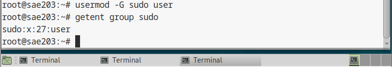{ width=500 }

Installation des suppléments :

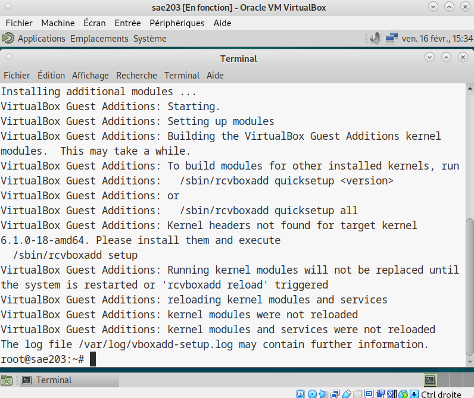{ width=500 }

[^3]: Signifie Superuser Do

---

### Question 3. sudo

---

| Question                     | Réponse                                                                                                     |
|------------------------------|-------------------------------------------------------------------------------------------------------------|
| À quels groupes appartient l'utilisateur user ? | Pour le savoir, on peut utiliser les commandes suivantes : `getent group sudo` ou `id` 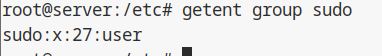{ width=500 } |

---

### Question 4. Suppléments invités

---

| Question                                           | Réponse                                                                                                                                        |
|----------------------------------------------------|------------------------------------------------------------------------------------------------------------------------------------------------|
| Version du noyau Linux de votre VM                | 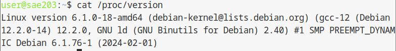                                                                                    |
| Rôles des suppléments invités et deux raisons    | Les suppléments invités améliorent les performances du système hôte et les interactions avec l'invité. Ils permettent les dossiers partagés et la synchronisation de l'heure. |
| Utilité de la commande mount                       | La commande `mount` permet de monter une partition dans un répertoire donné. Dans notre cas, elle a servi à installer les suppléments sur notre VM. |

---

## A propos de la distribution Debian

### Question 5. Quelques questions sur la distribution debian
| Question                                                                                     | Réponse                                                                                                                                          |
|---------------------------------------------------------------------------------------------|--------------------------------------------------------------------------------------------------------------------------------------------------|
| Qu’est-ce que le Projet Debian ? D’où vient le nom Debian ?                                | Le nom du projet Debian vient du nom de son créateur Ian Murdock et de son épouse Debra. L'objectif du projet est de créer un système d'exploitation composé exclusivement de fichiers libres. |
| Il existe 3 durées de prise en charge (support) de ces versions : la durée minimale, la durée en support long terme (LTS) et la durée en support long terme étendue (ELTS). Quelle sont les durées de ces prises en charge ? | - La version minimale de Debian est généralement supportée pendant environ 5 ans. - La version LTS étend ce support à environ 5 ans supplémentaires. - La version ELTS fournit un support encore plus étendu, généralement pour une période de 3 ans supplémentaire après la fin du support LTS. |
| Pendant combien de temps les mises à jour de sécurité seront-elles fournies ?              | Certaines versions peuvent être fournies pendant une période totale allant jusqu'à 13 ans.                                                        |
| Combien de versions au minimum sont activement maintenues par Debian ? Donnez leur nom générique (= les types de distribution) | - Debian maintient généralement deux versions : une version stable et une version de test. - Actuellement, les versions maintenues sont Debian 10 (Buster) avec un support LTS jusqu'en juillet 2024 et Debian 11 (Bullseye) avec un support LTS mais les dates exactes ne sont pas encore précisées. |
| Chaque distribution majeure possède un nom de code différent. D’où viennent les noms de code donnés aux distributions ? | Les noms de code des différentes versions de Debian proviennent des noms de personnages des films Toy Story de Pixar.                           |
| L’un des atouts de Debian fut le nombre d’architectures ( processeurs) officiellement prises en charge. Combien et lesquelles sont prises en charge par la version Bullseye ? | La version Debian 11 (Bullseye) prend en charge 13 architectures officiellement reconnues.                                                  |
| La première version de Debian est Debian 1.1                                                | - Le premier nom de code utilisé était Buzz - La version a été publiée en 1996 - Le numéro de distribution de cette version est 1.1             |
| La dernière version de Debian est Debian 12                                                 | - Le dernier nom de code utilisé était Bookworm - La version a été publiée le 10 Juin 2023 - Le numéro de distribution de cette version est 12 |


---

## Installation préconfigurée
| Étape | Description |
| ----- | ----------- |
| Téléchargement du fichier autoinstall_debian | Récupérer le fichier autoinstall_debian et le placer dans le répertoire contenant la machine virtuelle |
| Insertion du fichier S203_Debian12.viso | Insérer le fichier S203_Debian12.viso dans le lecteur optique de la machine virtuelle |
| Installation des logiciels supplémentaires | Installer les logiciels supplémentaires nécessaires pour la configuration automatique |

Par la suite on va insérer le fichier S203_Debian12.viso dans le lecteur optique.

Après avoir mis l'iso autoinstall la vm n'aura plus d'interface graphique mais juste un terminal.

Ensuite on va devoir ajuster notre pré-configuration, pour cela on va devoir installer des paquets.

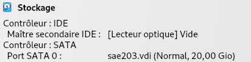{ width=500 }

### Question 6. Ajustement de la pré-configuration

---
Ne pas oublier de apt update après chaque install
---

| Commande                                  | Description                        |
| ---------------------------------------- | ---------------------------------- |
| `apt update`                              | Mettre à jour la liste des paquets disponibles |
| `apt install mate-desktop-environment`    | Installer l'environnement de bureau MATE |
| `apt install sudo`                        | Installer le paquet sudo           |
| `apt install git`                         | Installer le paquet git            |
| `apt install sqlite3`                     | Installer le paquet sqlite3        |
| `apt install curl`                        | Installer le paquet curl           |
| `apt install bash-completion`             | Installer le paquet bash-completion |
| `apt install neofetch`                    | Installer le paquet neofetch       |


---

## Configuration globale de git

Pour configurer git on va devoir entrer les 3 commandes suivantes dans un terminal :

| Commande                                             | Description                        |
| ---------------------------------------------------- | ---------------------------------- |
| `git config --global user.name "Prénom Nom"`        | Ajouter un nom d'utilisateur      |
| `git config --global user.email "votre@email"`      | Ajouter une adresse e-mail        |
| `git config --global init.defaultBranch "master"`    | Éviter le Warning sur la création d'une branche par défaut |

---

### Les interfaces graphiques pour git

---

### Questions 7. Préleminaire

1. Qu’est-ce que le logiciel gitk ? Comment se lance-t-il ?

   Gitk est un logiciel d'interface graphique intégré à git, gitk permet de visualiser l'historique des commits, les branches, les tags et d'autres informations liées à un dépôt git de manière interactive.

   Pour installer git on utilise la commande apt install
   Pour lancer gitk on peut le lancer via la commande suivante ou ajouter un '&' pour permettre de lancer Gitk en arrière plan:

| Commande                                             | Description                        |
| ---------------------------------------------------- | ---------------------------------- |
| `apt update`                              | Mettre à jour la liste des paquets disponibles |
| `apt install gitk`                        | Installer le paquet gitk           |
| `gitk`                                    | Lance gitk  |
| `gitk &`                                  | Lance gitk en arrière plan |

1. Qu’est-ce que le logiciel git-gui ? Comment se lance-t-il ?

   Git-gui est un autre logiciel d'interface graphique pour Git, mais il se concentre davantage sur les opérations quotidiennes et les interactions avec Git plutôt que sur la visualisation de l'historique des commits comme Gitk. Git GUI permet d'exécuter des actions telles que l'initialisation d'un nouveau dépôt, l'ajout et la gestion des fichiers, la création de commits, la gestion des branches, la fusion de branches, la configuration de Git, etc.

   Pour instaler git-gui on utilise la commande apt install
   Pour lancer git-gui on peut le lancer via la commande suivante ou ajouter un '&' pour permettre de lancer git-gui en arrière plan:

| Commande                                 | Description                        |
| ---------------------------------------- | ---------------------------------- |
| `apt update`                             | Mettre à jour la liste des paquets disponibles |
| `apt install git-gui`                    | Installer le paquet git-gui |
| `git gui`                                | Lance git gui           |
| `git gui  &`                             | Lance git gui en arrière plan         |

---

### Installation et comparaison d'un autre dépot git

---

### Question 8. Comparaison

1. Pourquoi avez-vous choisi ce logiciel ?

   On a décidé de choisir le logiciel GitKraken car il possède de nombreuses fonctionnalités pratiques et une interface graphique claire.

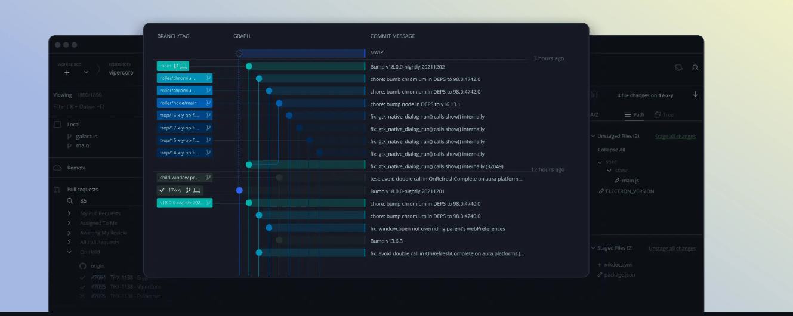{ width=500 }

1. Comment l’avez vous installé ?

   Pour l'installer on est allé sur le site officiel de  [GitKraken](https://www.gitkraken.com)
2. Comparer-le aux outils inclus avec git (et installé précédemment) ainsi qu’avec ce qui serait fait en ligne de commande pure : fonctionnalités avantages, inconvénients…

| Fonctionnalités / Outils     | GitKraken | Git en ligne de commande | Avantages | Inconvénients |
| ----------------------------- | --------- | ------------------------ | --------- | ------------- |
| Interface graphique conviviale | Oui       | Non                      | Convivialité pour les utilisateurs moins familiers avec la ligne de commande | Dépendance à une interface graphique |
| Visualisation intuitive de l'historique et des modifications | Oui | Non | Facilite la compréhension de l'historique et des changements | Peut être moins flexible pour les utilisateurs avancés |
| Intégration avec des services Git populaires | Oui | Oui | Facilite l'utilisation avec des services externes tels que GitHub, GitLab, etc. | Dépendance à des services externes |
| Contrôle précis sur les opérations Git | Non | Oui | Permet une personnalisation avancée des opérations | Nécessite une connaissance approfondie de Git en ligne de commande |

- Les fonctionnalités de GitKraken:
  - Interface graphique conviviale pour visualiser les branches, les commits, les conflits et les différences de fichiers.
  - Intégration avec des plateformes de dépôt Git populaires comme GitHub, GitLab, Bitbucket, etc.
  - Possibilité de créer et de gérer des branches, de fusionner des branches, de créer des commits, etc., tout en utilisant une interface utilisateur graphique.
  - Prise en charge des fonctionnalités avancées telles que la gestion des submodules, les remises, etc.
    Possibilité d'ajouter des notes, des étiquettes, des filtres, etc.
- Les avantages de GitKraken:
  - Convivialité : convient aux utilisateurs moins familiers avec la ligne de commande Git.
  - Visualisation intuitive de l'historique et des modifications.
  - Intégration directe avec les services Git populaires.
- Les inconveniants de GitKraken:
  - Dépendance à une interface graphique, ce qui peut ne pas convenir à certains utilisateurs préférant la ligne de commande.
  - Peut être moins flexible pour les utilisateurs avancés qui préfèrent un contrôle précis sur leurs opérations Git.
- Les fonctionnalités de ligne de commande pure
  - Offre toutes les fonctionnalités de Git sans dépendance à une interface graphique ou à des outils tiers.
  - Permet un contrôle total sur les opérations Git.
  - Flexibilité pour automatiser les tâches à l'aide de scripts.
- Les avantages
  - Contrôle complet sur les opérations Git.
  - Peut être utilisé dans des environnements sans interface graphique.
- Les inconvenients
  - Peut être intimidant pour les utilisateurs débutants ou moins à l'aise avec la ligne de commande.
  - Moins convivial pour la visualisation graphique de l'historique et des modifications.

  En résumé, GitKraken offre une interface graphique conviviale pour travailler avec Git, ce qui le rend idéal pour les utilisateurs moins familiers avec la ligne de commande. Les outils inclus avec Git offrent un contrôle précis sur les opérations Git et peuvent être automatisés via des scripts, tandis que la ligne de commande pure offre un contrôle total mais peut être plus complexe pour les débutants. Le choix entre ces options dépend des préférences et des besoins spécifiques de l'utilisateur. 


---

## Installation Gitea

### Redirection de port

---

Nous avons fait la redirection de port de notre machine physique vers notre machine virtuelle :

### Questions 9. A propos de Gitea

| Question | Réponse              |
| -------- | -------------------- |
| Qu'est-ce que Gitea ? | Gitea est un logiciel de gestion de développement logiciel sous format de versionnage GIT. Il est libre et open source (sous licence MIT). Il permet aussi l'ajout d'extensions pour plus de flexibilité. |
| À quels logiciels bien connus dans ce domaine peut-on le comparer (en citer au moins 2) ? | On peut le comparer avec GitLab et GitHub qui sont également des logiciels de gestion de version. |

---

### Installations du binaire

---


Pour installer gitea on va devoir accéder au site officiel de gitea.

On choisira la version gitea-121.7-linux-amd64

Il est préférable de directement se mettre dans le répertoire /usr/local/bin/ et d'éxécuter la commande suivante

Il faut bien vérifier que la version de git est >= 2.0

```
wget -O gitea https://dl.gitea.com/gitea/1.21.7/gitea-1.21.7-linux-amd64
```

Après l'installation il ne faut pas oublier de donner toute les permissions avec la commande suivante

```
chmod +x gitea
```

Ensuite on va créer un utilisateur git pour modifier tous les fichiers gitea avec la commande suivante

```
adduser \
   --system \
   --shell /bin/bash \
   --gecos 'Git Version Control' \
   --group \
   --disabled-password \
   --home /home/git \
   git
```

On va créer les dossiers nécessaires pour gitea et donner les permissions pour que uniquement l'utilisateur git puisse modifier donc pour faire les prochaines modifications il faudra changer l'utilisateur sur git

```
mkdir -p /var/lib/gitea/{custom,data,log}
chown -R git:git /var/lib/gitea/
chmod -R 750 /var/lib/gitea/
mkdir /etc/gitea
chown root:git /etc/gitea
chmod 770 /etc/gitea
```

Ensuite placez-vous dans le répertoire /var/lib/gitea/ et créer un fichier app.ini qui servira pour gitea lors des lancements.

```
nano app.ini
```

Une fois dans le fichier app.ini veuillez copier et coller le script ci-dessous

```
PP_NAME = Gitea: Git with a cup of tea
RUN_USER = git
WORK_PATH = /var/lib/gitea
RUN_MODE = prod

[server]
ROOT_URL = http://localhost:3000/
HTTP_PORT = 3000
SSH_DOMAIN = localhost
DOMAIN = localhost
APP_DATA_PATH = /var/lib/gitea/data
DISABLE_SSH = false
SSH_PORT = 22
LFS_START_SERVER = true
LFS_JWT_SECRET = zdcNjXDvL--lkGqwWmGfxUeDFzymYfQpqqUVrUM6tVM
OFFLINE_MODE = false

[database]
DB_TYPE = sqlite3
HOST = 127.0.0.1:3306
NAME = gitea
USER = root
PASSWD =
SCHEMA =
SSL_MODE = disable
PATH = /var/lib/gitea/data/gitea.db
LOG_SQL = false

[repository]
ROOT = /var/lib/gitea/repos

[security]
INTERNAL_TOKEN = votre_token_interne
INSTALL_LOCK = true
PASSWORD_HASH_ALGO = pbkdf2

[log]
MODE = file
LEVEL = info
ROOT_PATH = /var/lib/gitea/log

[service]
REGISTER_EMAIL_CONFIRM = false
ENABLE_NOTIFY_MAIL = false
DISABLE_REGISTRATION = false
ALLOW_ONLY_EXTERNAL_REGISTRATION = false
ENABLE_CAPTCHA = false
REQUIRE_SIGNIN_VIEW = false
DEFAULT_KEEP_EMAIL_PRIVATE = false
DEFAULT_ALLOW_CREATE_ORGANIZATION = true
DEFAULT_ENABLE_TIMETRACKING = true
NO_REPLY_ADDRESS = noreply.localhost

[lfs]
PATH = /var/lib/gitea/data/lfs
[mailer]
ENABLED = false

[openid]
ENABLE_OPENID_SIGNIN = true
ENABLE_OPENID_SIGNUP = true

[cron.update_checker]
ENABLED = false

[session]
PROVIDER = file

[repository.pull-request]
DEFAULT_MERGE_STYLE = merge

[repository.signing]
DEFAULT_TRUST_MODEL = committer

[oauth2]
JWT_SECRET = rY1bgly0hr5D13Xvjkm7UkBiGcQYf6BbBq-hKLs7590
```

Après avoir coller le script dans app.ini on peut créer un lien symbolique vers ce fichier

```
sudo ln -s /etc/gitea/app.ini /var/lib/gitea/conf/app.ini
```

La prochaine étape sera de préparer le lancement de gitea mais avant cela veuillez installer marriadb-server

```
apt install mariadb-server -y
```

Ensuite on va créer le script de service systemd
Veuillez suivre les étapes :

1. Ouvrez un éditeur de texte , comme nano, pour créer un nouveau fichier de script de service:

```
sudo nano /etc/systemd/system/gitea.service
```

1. Copiez le script ci-dessous dans gitea.service et de Ctrl-s pour sauvegarder et Ctrl-x pour quitter.

```
[Unit]
Description=Gitea (Git with a cup of tea)
After=syslog.target
After=network.target
After=mariadb.service
Requires=mariadb.service

[Service]
RestartSec=2s
Type=simple
User=git
Group=git
WorkingDirectory=/var/lib/gitea/
ExecStart=/usr/local/bin/gitea web -c /etc/gitea/app.ini
Restart=always
Environment=USER=git HOME=/home/git GITEA_WORK_DIR=/var/lib/gitea

[Install]
WantedBy=multi-user.target
```

| Commande                                           | Description                                                                      |
| -------------------------------------------------- | -------------------------------------------------------------------------------- |
| `sudo systemctl daemon-reload`                     | Rechargement des services systemd pour prendre en compte les modifications       |
| `sudo systemctl start gitea`                       | Démarrage du service Gitea                                                      |
| `sudo systemctl enable gitea`                      | Activation du service Gitea pour qu'il démarre automatiquement au démarrage      |


Une fois que avez fini les étapes d'installation, votre service gitea est prêt à être utilisé, pour l'utiliser allez sur le navigateur et entrez localhost:3000 pour arriver directement sur le dépôt gitea.

Normalement après avoir entrez dans localhost:3000 vous devrez avoir une interface de dépot gitea

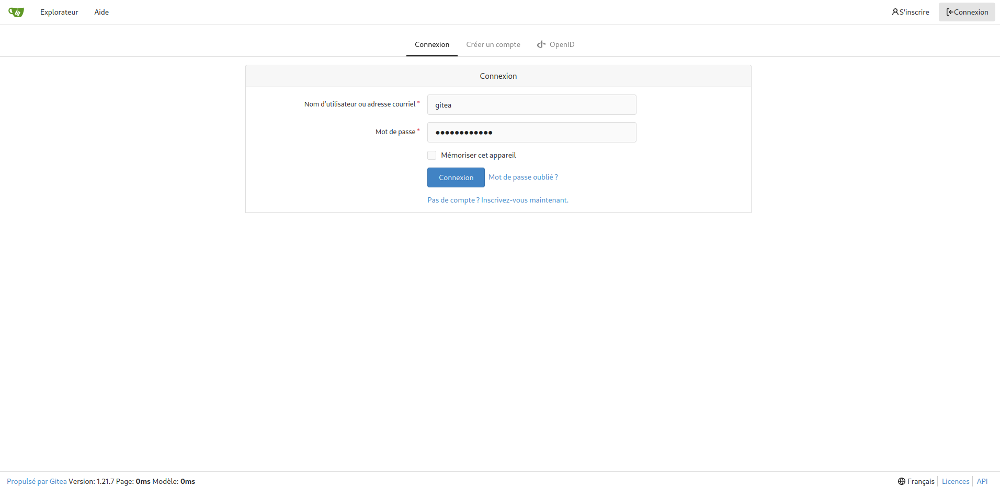{ width=500 }

Voud devriez obtenir l'interface de login dans le screen just en haut si tout fonctionne.

Une fois que vous avez entrée votre identifiant gitea cela nous amène à la page suivante:

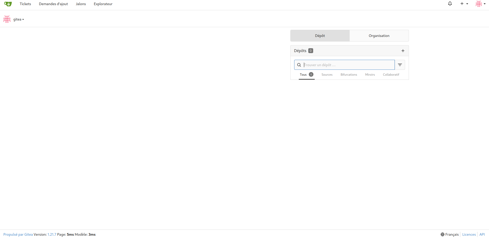{ width=500 }

C'est ici que tout les dépots et commits etc sera fait.

Au screen suivant vous pouvez accéder à la page d'admin pour tout les modifications nécessaires.

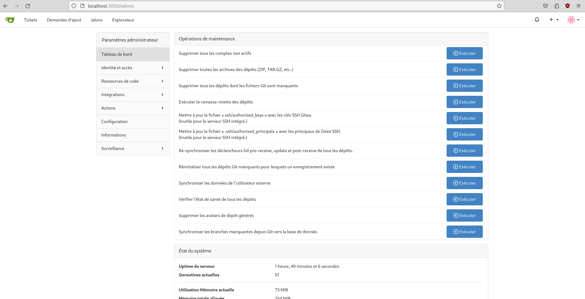{ width=500 }


